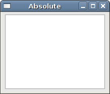
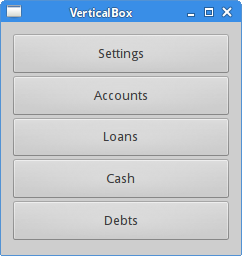
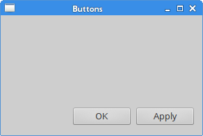
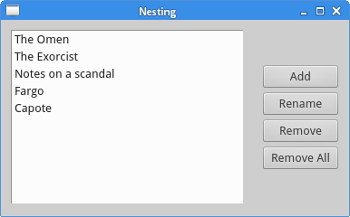
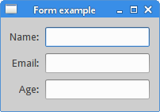
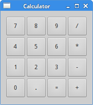
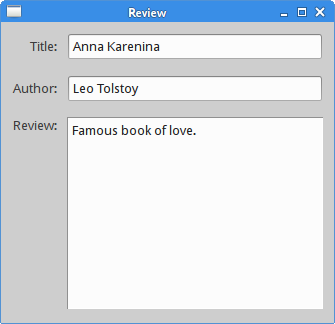

# Управление макетом в Qt5

В этой части руководства по программированию на Qt5 мы поговорим об управлении компоновкой виджетов. Мы упоминаем менеджеры QHBoxLayout, QVBoxLayout, QFormLayout и QGridLayout.

Типичное приложение состоит из различных виджетов. Эти виджеты размещаются внутри макетов. Программист должен управлять макетом приложения. В Qt5 у нас есть два варианта:

    абсолютное позиционирование
    менеджеры компоновки

## Абсолютное позиционирование

Программист указывает положение и размер каждого виджета в пикселях. Когда мы используем абсолютное позиционирование, мы должны понимать несколько вещей.

    Размер и положение виджета не меняются, если мы меняем размер окна.
    Приложения выглядят по-разному (часто плохо) на разных платформах.
    Изменение шрифтов в нашем приложении может испортить макет.
    Если мы решим изменить наш макет, мы должны полностью переделать наш макет, что утомительно и требует много времени.

Могут быть ситуации, когда мы можем использовать абсолютное позиционирование. Но в основном в реальных программах программисты используют менеджеры компоновки.

absolute.cpp
```
#include <QApplication>
#include <QDesktopWidget>
#include <QTextEdit>

class Absolute : public QWidget {

 public:
     Absolute(QWidget *parent = nullptr);
};

Absolute::Absolute(QWidget *parent)
    : QWidget(parent) {

  auto *ledit = new QTextEdit(this);
  ledit->setGeometry(5, 5, 200, 150);
}

int main(int argc, char *argv[]) {

  QApplication app(argc, argv);

  Absolute window;

  window.setWindowTitle("Absolute");
  window.show();

  return app.exec();
}
```
Метод setGeometry используется для позиционирования виджета в окне в абсолютных координатах.
```
auto *edit = new QTextEdit(this);
ledit->setGeometry(5, 5, 200, 150);
```
Мы создаем виджет QTextEdit и позиционируем его вручную. Метод setGeometry делает две вещи: позиционирует виджет в абсолютных координатах и изменяет размер виджета.


## Qt5 QVBoxLayout

Класс QVBoxLayout выстраивает виджеты вертикально. Виджеты добавляются в макет с помощью метода addWidget.

vertical_box.h
```
#pragma once

#include <QWidget>

class VerticalBox : public QWidget {

  public:
    VerticalBox(QWidget *parent = nullptr);
};
```

vertical_box.cpp
```
#include <QVBoxLayout>
#include <QPushButton>
#include "vertical_box.h"

VerticalBox::VerticalBox(QWidget *parent)
    : QWidget(parent) {

  auto *vbox = new QVBoxLayout(this);
  vbox->setSpacing(1);

  auto *settings = new QPushButton("Settings", this);
  settings->setSizePolicy(QSizePolicy::Expanding, QSizePolicy::Expanding);

  auto *accounts = new QPushButton("Accounts", this);
  accounts->setSizePolicy(QSizePolicy::Expanding, QSizePolicy::Expanding);

  auto *loans = new QPushButton("Loans", this);
  loans->setSizePolicy(QSizePolicy::Expanding, QSizePolicy::Expanding);

  auto *cash = new QPushButton("Cash", this);
  cash->setSizePolicy(QSizePolicy::Expanding, QSizePolicy::Expanding);

  auto *debts = new QPushButton("Debts", this);
  debts->setSizePolicy(QSizePolicy::Expanding, QSizePolicy::Expanding);

  vbox->addWidget(settings);
  vbox->addWidget(accounts);
  vbox->addWidget(loans);
  vbox->addWidget(cash);
  vbox->addWidget(debts);

  setLayout(vbox);
}
```
В нашем примере у нас есть один менеджер вертикальной компоновки. В него вставляем пять кнопок. Мы делаем все кнопки расширяемыми в обе стороны.
```
auto *vbox = new QVBoxLayout(this);
vbox->setSpacing(1);
```
Мы создаем QVBoxLayout и устанавливаем интервал в 1 пиксель между дочерними виджетами.
```
auto *settings = new QPushButton("Settings", this);
settings->setSizePolicy(QSizePolicy::Expanding, QSizePolicy::Expanding);
```
Мы создаем кнопку и устанавливаем для нее политику размера. Дочерние виджеты управляются менеджером компоновки. По умолчанию кнопка расширяется по горизонтали и имеет фиксированный размер по вертикали. Если мы хотим изменить его, мы устанавливаем новую политику размера. В нашем случае кнопка расширяется в обе стороны.
```
vbox->addWidget(settings);
vbox->addWidget(accounts);
```
Мы добавляем дочерние виджеты в менеджер компоновки с помощью метода addWidget.
setLayout(vbox);

Мы устанавливаем менеджер QVBoxLayout для окна.

main.cpp
```
#include <QApplication>
#include "vertical_box.h"

int main(int argc, char *argv[]) {

  QApplication app(argc, argv);

  VerticalBox window;

  window.resize(240, 230);
  window.setWindowTitle("VerticalBox");
  window.show();

  return app.exec();
}
```



## Кнопки

В следующем примере мы отображаем две кнопки в клиентской области окна. Они будут расположены в правом нижнем углу окна.

buttons.h
```
#pragma once

#include <QWidget>
#include <QPushButton>

class Buttons : public QWidget {

  public:
    Buttons(QWidget *parent = nullptr);

  private:
    QPushButton *okBtn;
    QPushButton *applyBtn;
};
```

buttons.cpp
```
#include <QVBoxLayout>
#include <QHBoxLayout>
#include "buttons.h"

Buttons::Buttons(QWidget *parent)
    : QWidget(parent) {

  auto *vbox = new QVBoxLayout(this);
  auto *hbox = new QHBoxLayout();

  okBtn = new QPushButton("OK", this);
  applyBtn = new QPushButton("Apply", this);

  hbox->addWidget(okBtn, 1, Qt::AlignRight);
  hbox->addWidget(applyBtn, 0);

  vbox->addStretch(1);
  vbox->addLayout(hbox);
}
```
Скажем, мы хотели иметь две кнопки в правом нижнем углу окна.
```
auto *vbox = new QVBoxLayout(this);
auto *hbox = new QHBoxLayout();
```
Мы создаем два менеджера размещения блоков: один вертикальный и один горизонтальный менеджер размещения блоков.
```
okBtn = new QPushButton("OK", this);
applyBtn = new QPushButton("Apply", this);
```
Создаем две кнопки.
```
hbox->addWidget(okBtn, 1, Qt::AlignRight);
hbox->addWidget(applyBtn, 0);
```
Кнопки размещены внутри менеджера горизонтальной компоновки. с помощью метода addWidget. Эти кнопки выровнены по правому краю. Первый параметр — это дочерний виджет. Второй параметр — коэффициент растяжения, а последний параметр — выравнивание. Установив коэффициент растяжения на 1 для кнопки OK, мы даем ей пространство от левой до правой стороны окна. Виджет не расширяется на все отведенное ему пространство. Наконец, константа Qt::AlignRight выравнивает виджет справа от выделенного пространства.
```
vbox->addStretch(1);
vbox->addLayout(hbox);
```
Мы помещаем пустое расширяемое пространство в вертикальное поле, вызывая метод addStretch. Затем мы добавляем горизонтальный макет блока к вертикальному макету блока.

main.cpp
```
#include <QApplication>
#include "buttons.h"

int main(int argc, char *argv[]) {

  QApplication app(argc, argv);

  Buttons window;

  window.resize(290, 170);
  window.setWindowTitle("Buttons");
  window.show();

  return app.exec();
}
```


## Вложенные макеты Qt5

Идея следующего примера состоит в том, чтобы показать, что менеджеры компоновки можно комбинировать. Комбинируя даже простые макеты, мы можем создавать сложные диалоги или окна. Для вложения макетов мы используем метод addLayout.

nesting.h
```
#pragma once

#include <QWidget>

class Layouts : public QWidget {

  public:
    Layouts(QWidget *parent = nullptr);
};
```

nesting.cpp
```
#include <QVBoxLayout>
#include <QPushButton>
#include <QListWidget>
#include "nesting.h"

Layouts::Layouts(QWidget *parent)
    : QWidget(parent) {

  auto *vbox = new QVBoxLayout();
  auto *hbox = new QHBoxLayout(this);

  auto *lw = new QListWidget(this);
  lw->addItem("The Omen");
  lw->addItem("The Exorcist");
  lw->addItem("Notes on a scandal");
  lw->addItem("Fargo");
  lw->addItem("Capote");

  auto *add = new QPushButton("Add", this);
  auto *rename = new QPushButton("Rename", this);
  auto *remove = new QPushButton("Remove", this);
  auto *removeall = new QPushButton("Remove All", this);

  vbox->setSpacing(3);
  vbox->addStretch(1);
  vbox->addWidget(add);
  vbox->addWidget(rename);
  vbox->addWidget(remove);
  vbox->addWidget(removeall);
  vbox->addStretch(1);

  hbox->addWidget(lw);
  hbox->addSpacing(15);
  hbox->addLayout(vbox);

  setLayout(hbox);
}
```

В примере мы создаем окно, состоящее из четырех кнопок и одного виджета списка. Кнопки сгруппированы в вертикальный столбец и размещены справа от виджета списка. Если мы изменим размер окна, размер виджета списка также изменится.
```
auto *vbox = new QVBoxLayout();
```
QVBoxLayout — это столбец для кнопок.
```
auto *hbox = new QHBoxLayout(this);
```
QHBoxLayout — это базовый макет для виджетов.
```
auto *lw = new QListWidget(this);
lw->addItem("The Omen");
lw->addItem("The Exorcist");
lw->addItem("Notes on a scandal");
lw->addItem("Fargo");
lw->addItem("Capote");
```
QListWidget создан.
```
auto *add = new QPushButton("Add", this);
auto *rename = new QPushButton("Rename", this);
auto *remove = new QPushButton("Remove", this);
auto *removeall = new QPushButton("Remove All", this);
```
Здесь мы создаем наши четыре кнопки.
```
vbox->setSpacing(3);
vbox->addStretch(1);
vbox->addWidget(add);
vbox->addWidget(rename);
vbox->addWidget(remove);
vbox->addWidget(removeall);
vbox->addStretch(1);
```
Создан вертикальный блок с четырьмя кнопками. Мы оставляем немного места между нашими кнопками. Обратите внимание, что мы добавляем коэффициент растяжения вверху и внизу вертикального прямоугольника. Таким образом, кнопки располагаются вертикально по центру.
```
hbox->addWidget(lw);
hbox->addSpacing(15);
hbox->addLayout(vbox);
```
Виджет списка и вертикальный блок кнопок помещаются в макет горизонтального блока. Метод addLayout используется для добавления макета в другой макет.
```
setLayout(hbox);
```
Мы устанавливаем базовый макет для родительского окна.

main.cpp
```
#include <QApplication>
#include "nesting.h"

int main(int argc, char *argv[]) {

  QApplication app(argc, argv);

  Layouts window;

  window.setWindowTitle("Layouts");
  window.show();

  return app.exec();
}
```



##Qt5 FormLayout

QFormLayout — это простой менеджер компоновки, который управляет формами виджетов ввода и связанными с ними метками. Он размещает своих дочерних элементов в виде двух столбцов. Левый столбец состоит из меток, а правый столбец состоит из виджетов ввода, таких как QLineEdit или QSpinBox.

form.h
```
#pragma once

#include <QWidget>

class FormEx : public QWidget {

  public:
    FormEx(QWidget *parent = nullptr);
};
```

form.cpp
```
#include <QFormLayout>
#include <QLabel>
#include <QLineEdit>
#include "form.h"

FormEx::FormEx(QWidget *parent)
    : QWidget(parent) {

  auto *nameEdit = new QLineEdit(this);
  auto *addrEdit = new QLineEdit(this);
  auto *occpEdit = new QLineEdit(this);

  auto *formLayout = new QFormLayout;
  formLayout->setLabelAlignment(Qt::AlignRight | Qt::AlignVCenter);
  formLayout->addRow("Name:", nameEdit);
  formLayout->addRow("Email:", addrEdit);
  formLayout->addRow("Age:", occpEdit);

  setLayout(formLayout);
}
```
В примере создается форма, состоящая из трех меток и трех строк редактирования.
```
auto *formLayout = new QFormLayout;
```
Создается экземпляр QFormLayout.
formLayout->setLabelAlignment(Qt::AlignRight | Qt::AlignVCenter);

С помощью метода setLabelAlignment мы устанавливаем выравнивание виджетов меток.
```
formLayout->addRow("Name:", nameEdit);
```
Метод addRow добавляет новую строку в нижнюю часть макета формы с заданной меткой и виджетом ввода.

main.cpp
```
#include <QApplication>
#include "form.h"

int main(int argc, char *argv[]) {

  QApplication app(argc, argv);

  FormEx window;

  window.setWindowTitle("Form example");
  window.show();

  return app.exec();
}
```


## Qt5 QGridLayout

QGridLayout помещает свои виджеты в сетку. Это мощный менеджер компоновки.

calculator.h
```
#pragma once

#include <QWidget>

class Calculator : public QWidget {

  public:
    Calculator(QWidget *parent = nullptr);
};
```
 
calculator.cpp
```
#include <QGridLayout>
#include <QPushButton>
#include "calculator.h"

Calculator::Calculator(QWidget *parent)
    : QWidget(parent) {

  auto *grid = new QGridLayout(this);
  grid->setSpacing(2);

  QVector<QString> values({ "7", "8", "9", "/",
    "4", "5", "6", "*",
    "1", "2", "3", "-",
    "0", ".", "=", "+"
  });

  int pos = 0;

  for (int i=0; i<4; i++) {
   for (int j=0; j<4; j++) {

     auto *btn = new QPushButton(values[pos], this);
     btn->setFixedSize(40, 40);
     grid->addWidget(btn, i, j);
     pos++;
   }
  }

  setLayout(grid);
}
```
Создаем скелет калькулятора.
```
auto *grid = new QGridLayout(this);
grid->setSpacing(2)
```
Мы создаем макет сетки и устанавливаем интервал 2 пикселя между дочерними виджетами.
```
QVector<QString> values({ "7", "8", "9", "/",
  "4", "5", "6", "*",
  "1", "2", "3", "-",
  "0", ".", "=", "+"
});
```
Это символы, которые отображаются на кнопках.
```
for (int i=0; i<4; i++) {
  for (int j=0; j<4; j++) {

    auto *btn = new QPushButton(values[pos], this);
    btn->setFixedSize(40, 40);
    grid->addWidget(btn, i, j);
    pos++;
  }
}
```
Мы размещаем шестнадцать виджетов в макете сетки. Каждая из кнопок имеет фиксированный размер.

main.cpp
```
#include <QApplication>
#include "calculator.h"

int main(int argc, char *argv[]) {

  QApplication app(argc, argv);

  Calculator window;

  window.setWindowTitle("Calculator");
  window.show();

  return app.exec();
}
```


## Обзор

В следующем примере этой главы мы создаем более сложное окно с помощью менеджера QGridLayout.

review.h
```
#pragma once

#include <QWidget>

class Review : public QWidget {

  public:
    Review(QWidget *parent = nullptr);
};
```
 
review.cpp
```
#include <QGridLayout>
#include <QLabel>
#include <QLineEdit>
#include <QTextEdit>
#include "review.h"

Review::Review(QWidget *parent)
    : QWidget(parent) {

  auto *grid = new QGridLayout(this);
  grid->setVerticalSpacing(15);
  grid->setHorizontalSpacing(10);

  auto *title = new QLabel("Title:", this);
  grid->addWidget(title, 0, 0, 1, 1);
  title->setAlignment(Qt::AlignRight | Qt::AlignVCenter);

  auto *edt1 = new QLineEdit(this);
  grid->addWidget(edt1, 0, 1, 1, 1);

  auto *author = new QLabel("Author:", this);
  grid->addWidget(author, 1, 0, 1, 1);
  author->setAlignment(Qt::AlignRight | Qt::AlignVCenter);

  auto *edt2 = new QLineEdit(this);
  grid->addWidget(edt2, 1, 1, 1, 1);

  auto *review = new QLabel("Review:", this);
  grid->addWidget(review, 2, 0, 1, 1);
  review->setAlignment(Qt::AlignRight | Qt::AlignTop);

  auto *te = new QTextEdit(this);
  grid->addWidget(te, 2, 1, 3, 1);

  setLayout(grid);
}
```
Код создает окно, которое можно использовать для ввода автора, названия и рецензии на книгу.
```
auto *grid = new QGridLayout(this);
```
Менеджер QGridLayout создан.
```
grid->setVerticalSpacing(15);
grid->setHorizontalSpacing(10);
```
Мы добавляем вертикальный интервал с помощью метода setVerticalSpacing и горизонтальный интервал с помощью метода setHorizontalSpacing.
```
auto *title = new QLabel("Title", this);
grid->addWidget(title, 0, 0, 1, 1);
```
Эти строки кода создают виджет метки и помещают его в макет сетки. Метод addWidget имеет пять параметров. Первый параметр — это дочерний виджет, в нашем случае метка. Следующие два параметра — это строка и столбец в сетке, где мы размещаем метку. Наконец, последними параметрами являются rowspan и colspan. Эти параметры определяют, сколько строк будет охватывать текущий виджет. В нашем случае метка будет охватывать только один столбец и одну строку.
```
title->setAlignment(Qt::AlignRight | Qt::AlignVCenter);
```
Метод setAlignment выравнивает метку заголовка в своей ячейке. По горизонтали он выровнен по правому краю. По вертикали он центрирован.
```
auto *te = new QTextEdit(this);
grid->addWidget(te, 2, 1, 3, 1);
```
Виджет QTextEdit помещается в третью строку и второй столбец; он охватывает три строки и один столбец.

main.cpp
```
#include <QApplication>
#include "review.h"

int main(int argc, char *argv[]) {

  QApplication app(argc, argv);

  Review window;

  window.setWindowTitle("Review");
  window.show();

  return app.exec();
}
```


Эта часть руководства по Qt5 была посвящена управлению компоновкой.

