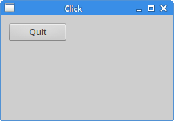
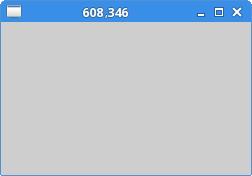
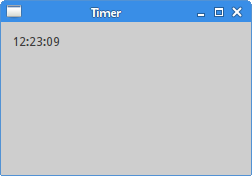

# События и сигналы в Qt5

В этой части руководства по программированию Qt5 C++ мы говорим о событиях и сигналах.

События являются важной частью любой программы с графическим интерфейсом. Все приложения с графическим интерфейсом управляются событиями. Приложение реагирует на различные типы событий, которые генерируются в течение его жизни. События генерируются в основном пользователем приложения. Но они могут быть созданы и другими способами, например. Интернет-соединение, оконный менеджер или таймер. В событийной модели есть три участника:

- источник события
- объект события
- цель события

Источником события является объект, состояние которого изменяется. Он генерирует События. Объект события (Event) инкапсулирует изменения состояния в источнике события. Цель события — это объект, который необходимо уведомить. Объект-источник события делегирует задачу обработки события цели события.

Когда мы вызываем метод exec приложения, приложение входит в основной цикл. Основной цикл извлекает события и отправляет их объектам. Qt имеет уникальный механизм сигналов и слотов. Этот механизм сигналов и слотов является расширением языка программирования C++.

Сигналы и слоты используются для связи между объектами. Сигнал испускается, когда происходит определенное событие. Слот — это обычный метод C++; он вызывается, когда излучается связанный с ним сигнал.

## Пример клика Qt5

В первом примере показан очень простой пример обработки событий. У нас есть одна кнопка. Нажав на кнопку, мы завершаем работу приложения.
click.h
```
pragma once

#include <QWidget>

class Click : public QWidget {

  public:
    Click(QWidget *parent = nullptr);
};
```
This is the header file.

click.cpp
```
#include <QPushButton>
#include <QApplication>
#include <QHBoxLayout>
#include "click.h"

Click::Click(QWidget *parent)
    : QWidget(parent) {

  auto *hbox = new QHBoxLayout(this);
  hbox->setSpacing(5);

  auto *quitBtn = new QPushButton("Quit", this);
  hbox->addWidget(quitBtn, 0, Qt::AlignLeft | Qt::AlignTop);

  connect(quitBtn, &QPushButton::clicked, qApp, &QApplication::quit);
}

```
Мы отображаем QPushButton в окне.
```
connect(quitBtn, &QPushButton::clicked, qApp, &QApplication::quit);
```
Метод connect подключает сигнал к слоту. Когда мы нажимаем кнопку Quit, генерируется сигнал clicked. qApp — это глобальный указатель на объект приложения. Он определен в заголовочном файле <QApplication>. Метод quit вызывается, когда испускается сигнал щелчка.

main.cpp
```
#include <QApplication>
#include "click.h"

int main(int argc, char *argv[]) {

  QApplication app(argc, argv);

  Click window;

  window.resize(250, 150);
  window.setWindowTitle("Click");
  window.show();

  return app.exec();
}
```
Это основной файл.



В следующем примере мы реагируем на нажатие клавиши.
keypress.h
```
#pragma once

#include <QWidget>

class KeyPress : public QWidget {

  public:
    KeyPress(QWidget *parent = 0);

  protected:
    void keyPressEvent(QKeyEvent * e);
};
```

keypress.cpp
```
#include <QApplication>
#include <QKeyEvent>
#include "keypress.h"

KeyPress::KeyPress(QWidget *parent)
    : QWidget(parent)
{ }

void KeyPress::keyPressEvent(QKeyEvent *event) {

   if (event->key() == Qt::Key_Escape) {
       qApp->quit();
   }
}
```
Приложение завршается, если мы нажимаем Esc.
```
void KeyPress::keyPressEvent(QKeyEvent *e) {

   if (e->key() == Qt::Key_Escape) {
       qApp->quit();
   }
}
```
Один из способов работы с событиями в Qt5 — переопределить обработчик событий. QKeyEvent — это объект события, который содержит информацию о том, что произошло. В нашем случае мы используем объект события, чтобы определить, какая клавиша была фактически нажата.
main.cpp
```
#include <QApplication>
#include "keypress.h"

int main(int argc, char *argv[]) {

  QApplication app(argc, argv);

  KeyPress window;

  window.resize(250, 150);
  window.setWindowTitle("Key press");
  window.show();

  return app.exec();
}
```

## QMoveEvent

Класс QMoveEvent содержит параметры событий для событий перемещения. События перемещения отправляются виджетам, которые были перемещены.
move.h
```
#pragma once

#include <QMainWindow>

class Move : public QWidget {

  Q_OBJECT

  public:
    Move(QWidget *parent = 0);

  protected:
    void moveEvent(QMoveEvent *e);
};
```

move.cpp
```
#include <QMoveEvent>
#include "move.h"

Move::Move(QWidget *parent)
    : QWidget(parent)
{ }

void Move::moveEvent(QMoveEvent *e) {

  int x = e->pos().x();
  int y = e->pos().y();

  QString text = QString::number(x) + "," + QString::number(y);

  setWindowTitle(text);
}
```
В нашем примере программирования кода мы реагируем на событие перемещения. Мы определяем текущие координаты x, y левого верхнего угла клиентской области окна и устанавливаем эти значения в заголовок окна.
```
int x = e->pos().x();
int y = e->pos().y();
```
Мы используем объект QMoveEvent для определения значений x, y.
```
QString text = QString::число(x) + "," + QString::число(y);
```
Мы конвертируем целочисленные значения в строки.
```
setWindowTitle(text);
```
Метод setWindowTitle задает текст заголовка окна.
main.cpp
```
#include <QApplication>
#include "move.h"

int main(int argc, char *argv[]) {

  QApplication app(argc, argv);

  Move window;

  window.resize(250, 150);
  window.setWindowTitle("Move");
  window.show();

  return app.exec();
}
```


## Отключение сигнала

Сигнал может быть отключен от слота. Следующий пример показывает, как мы можем это сделать.
disconnect.h
```
#pragma once

#include <QWidget>
#include <QPushButton>

class Disconnect : public QWidget {

  Q_OBJECT

  public:
    Disconnect(QWidget *parent = 0);

  private slots:
    void onClick();
    void onCheck(int);

  private:
    QPushButton *clickBtn;
};
```
В заголовочном файле мы объявили два слота. Слоты — это не ключевое слово C++, это расширение Qt5. Эти расширения обрабатываются препроцессором до компиляции кода. Когда мы используем сигналы и слоты в наших классах, мы должны предоставить макрос Q_OBJECT в начале определения класса. В противном случае препроцессор будет жаловаться.
disconnect.cpp
```
#include <QTextStream>
#include <QCheckBox>
#include <QHBoxLayout>
#include "disconnect.h"

Disconnect::Disconnect(QWidget *parent)
    : QWidget(parent) {

  QHBoxLayout *hbox = new QHBoxLayout(this);
  hbox->setSpacing(5);

  clickBtn = new QPushButton("Click", this);
  hbox->addWidget(clickBtn, 0, Qt::AlignLeft | Qt::AlignTop);

  QCheckBox *cb = new QCheckBox("Connect", this);
  cb->setCheckState(Qt::Checked);
  hbox->addWidget(cb, 0, Qt::AlignLeft | Qt::AlignTop);

  connect(clickBtn, &QPushButton::clicked, this, &Disconnect::onClick);
  connect(cb, &QCheckBox::stateChanged, this, &Disconnect::onCheck);
}

void Disconnect::onClick() {

  QTextStream out(stdout);
  out << "Button clicked" << endl;
}

void Disconnect::onCheck(int state) {

  if (state == Qt::Checked) {
    connect(clickBtn, &QPushButton::clicked, this, &Disconnect::onClick);
  } else {
    disconnect(clickBtn, &QPushButton::clicked, this,
        &Disconnect::onClick);
  }
}
```

В нашем примере у нас есть кнопка и флажок. Флажок подключает и отключает слот от сигнала нажатия кнопок. Этот пример должен быть выполнен из командной строки.
```
connect(clickBtn, &QPushButton::clicked, this, &Disconnect::onClick);
connect(cb, &QCheckBox::stateChanged, this, &Disconnect::onCheck);
```
Здесь мы подключаем сигналы к нашим пользовательским слотам.
```
void Disconnect::onClick() {

  QTextStream out(stdout);
  out << "Button clicked" << endl;
}
```
Если мы нажмем кнопку Click, мы отправим текст «Кнопка нажата» в окно терминала.
```
void Disconnect::onCheck(int state) {

  if (state == Qt::Checked) {
    connect(clickBtn, &QPushButton::clicked, this, &Disconnect::onClick);
  } else {
    disconnect(clickBtn, &QPushButton::clicked, this, &Disconnect::onClick);
  }
}
```
Внутри слота onCheck мы подключаем или отключаем слот onClick от кнопки Click в зависимости от полученного состояния.
main.cpp
```
#include <QApplication>
#include "disconnect.h"

int main(int argc, char *argv[]) {

  QApplication app(argc, argv);

  Disconnect window;

  window.resize(250, 150);
  window.setWindowTitle("Disconnect");
  window.show();

  return app.exec();
}

```

## Таймер

Таймер используется для выполнения одиночных или повторяющихся задач. Хорошим примером использования таймера являются часы; каждую секунду мы должны обновлять нашу метку, отображающую текущее время.
timer.h
```
#pragma once

#include <QWidget>
#include <QLabel>

class Timer : public QWidget {

  public:
    Timer(QWidget *parent = 0);

  protected:
    void timerEvent(QTimerEvent *e);

  private:
    QLabel *label;
};
```
timer.cpp
```
#include "timer.h"
#include <QHBoxLayout>
#include <QTime>

Timer::Timer(QWidget *parent)
    : QWidget(parent) {

  QHBoxLayout *hbox = new QHBoxLayout(this);
  hbox->setSpacing(5);

  label = new QLabel("", this);
  hbox->addWidget(label, 0, Qt::AlignLeft | Qt::AlignTop);

  QTime qtime = QTime::currentTime();
  QString stime = qtime.toString();
  label->setText(stime);

  startTimer(1000);
}

void Timer::timerEvent(QTimerEvent *e) {

  Q_UNUSED(e);

  QTime qtime = QTime::currentTime();
  QString stime = qtime.toString();
  label->setText(stime);
}
```
В нашем примере, мы отобразим на экране местное время.
```
label = new QLabel("", this);
```
Для отображения времени мы используем метку виджета.
```
QTime qtime = QTime::currentTime();
QString stime = qtime.toString();
label->setText(stime);
```
Здесь мы определяем текущее местное время. Мы устанавливаем его в  метку виджета.
```
startTimer(1000);
```
Мы запускаем таймер. Каждые 1000 мс генерируется событие таймера.
```
void Timer::timerEvent(QTimerEvent *e) {

  Q_UNUSED(e);

  QTime qtime = QTime::currentTime();
  QString stime = qtime.toString();
  label->setText(stime);
}
```
To work with timer events, we must reimplement the timerEvent method.
main.cpp
```
#include <QApplication>
#include "timer.h"

int main(int argc, char *argv[]) {

  QApplication app(argc, argv);

  Timer window;

  window.resize(250, 150);
  window.setWindowTitle("Timer");
  window.show();

  return app.exec();
}
```


Эта глава была посвящена событиям и сигналам в Qt5.

